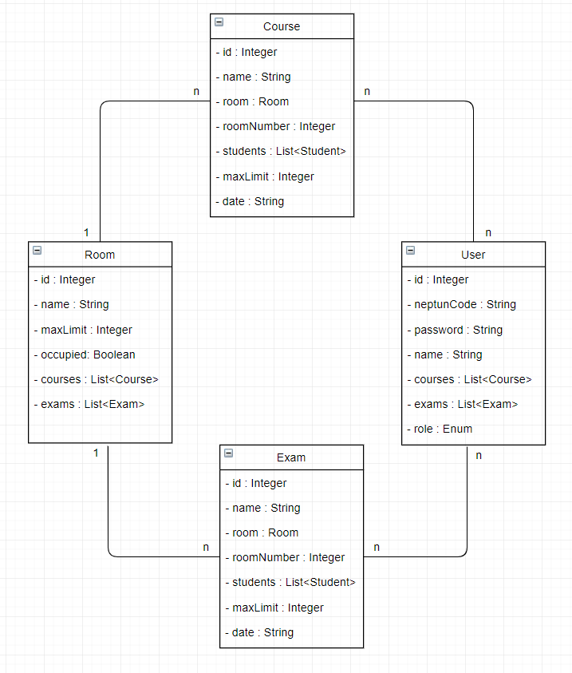

<H2>Alkalmazások fejlesztése beadandó</H2>
<H3>Bevezető</H3>

Az alapötlet a neptun mintájára épülő, az egyetem szereplői számára adminisztrációs feladatok(tantárgyak felvétele/menedzselése tanároknak/diákoknak) kezelésére alkalmas program létrehozása.

<H3>Követelményanalízis</H3>
<H4>Funkcionális követelmények</H4>
<ul>
  <li>Regisztráció</li>
  <li>Bejelentkezés</li>
  <li>Bejelentkezett felhasználóknak
    <ul>
      <li>Tanárnak</li>
        <ul>
          <li>Saját kurzusok törlése/megjelenítése órarendben</li> 
          <li>Saját vizsgák törlése/megjelenítése órarendben</li> 
          <li>Kurzusok/Vizsgák kilistázása</li>
        </ul>
      <li>Diáknak</li>
        <ul>
          <li>Kurzus felvétele/leadása</li>
          <li>Vizsga felvétele/leadása</li>
          <li>Kurzusok/Vizsgák kilistázása</li>
        </ul>
    </ul>
  </li>
</ul>
<H4>Nem funkcionális követelmények</H4>
<ul>
  <li>Felhasználóbarát: Megfelelően elhatárolt funkciók. Világos látható színekkel írt betűk. Ésszerű elrendezés.</li>
  <li>Biztonság: Jelszóval védett funkciók. A jelszavak titkosítottak. A különböző űrlapoknál egy hibalistában kijelzi a program a hibákat.</li>
  <li>Gyors működés: Adatbázisban operáló program, gyors kereséssekkel hamar előállítja a kívánt eredményeket.</li>
</ul>
<H4>Szakterületi fogalomjegyzék</H4>
<ul>
  <li>Kurzus: Az a keret, amelyben a hallgatók meghatározott rend (előadás, gyakorlat, házi feladat, stb.) szerint gyarapítják tudásukat, és arról számot is adnak.</li>
  <li>Vizsga: Tudás számonkérése arról, hogy egy tanuló a kurzus során megtanult anyagot mennyire értette meg, és hogyan tudja alkalmazni. </li>
</ul>

<H3>Tervezés</H3>

<H4>Szerepkörök</H4>
<ul>
  <li>Vendég: nem regisztrált látogató, aki csak a kezdőoldalt tudja megtekinteni, ahol csak regisztrációra/belépésre képes.</li>
  <li>Diák: lásd funkcionális követelmények</li>
  <li>Tanár: lásd funkcionális követelmények</li>
</ul>

<H4>Entitások</H4>
<ul>
  <li>Student
    <ul>
      <li>Id (Long)</li>
      <li>NeptunCode (String)</li>
      <li>Password (String)</li>
      <li>Name (String)</li>
      <li>Courses (List&lt;Course&gt;)</li>
      <li>Exams (List&lt;Exam&gt;)</li>
    </ul>
  </li>
  <li>Teacher
    <ul>
      <li>Id (Long)</li>
      <li>NeptunCode (String)</li>
      <li>Password (String)</li>
      <li>Name (String)</li>
      <li>Courses (List&lt;Course&gt;)</li>
      <li>Exams (List&lt;Exam&gt;)</li>
    </ul>
  </li>
  <li>Course
    <ul>
        <li>Id (Long)</li>
        <li>Name (String)</li>
        <li>MaxLimit (Integer)</li>
        <li>ClassRoom (String)</li>
        <li>Date (String)</li>
        <li>Teacher (Teacher)</li>
        <li>Students (List&lt;Student&gt;)</li>
    </ul>
  </li>
  <li>Exam
    <ul>
        <li>Id (Long)</li>
        <li>Name (String)</li>
        <li>MaxLimit (Integer)</li>
        <li>ClassRoom (String)</li>
        <li>Date (String)</li>
        <li>Teacher (Teacher)</li>
        <li>Students (List&lt;Student&gt;)</li>
    </ul>
  </li>
</ul>

<H4>Végpontok</H4>
<ul>
  <li>GET/
    <ul>
      <li>/courses: Kurzusok megjelenítése
         <ul>
           <li>/:id : Adott id-hez tartozó kurzus megjelenítése</li>
           <li>/:id/students: Adott id-hez tartozó kurzus diákjainak megjelenítése</li>
           <li>/:id/teacher: Adott id-hez tartozó kurzus tanárának megjelenítése</li>
         </ul>
      </li>
      <li>/exams: Vizsgák megjelenítése
         <ul>
           <li>/:id : Adott id-hez tartozó vizsga megjelenítése</li>
           <li>/:id/students: Adott id-hez tartozó vizsga diákjainak megjelenítése</li>
           <li>/:id/teacher: Adott id-hez tartozó vizsga tanárának megjelenítése</li>
         </ul>
      </li>
      <li>/teachers: Tanárok megjelenítése
         <ul>
           <li>/:id : Adott id-hez tartozó tanár megjelenítése</li>
           <li>/:id/courses: Adott id-hez tartozó tanár kurzusainak megjelenítése</li>
           <li>/:id/exams: Adott id-hez tartozó tanár vizsgáinak megjelenítése</li>
         </ul>
      </li>
      <li>/students: Diákok megjelenítése
         <ul>
           <li>/:id : Adott id-hez tartozó diák megjelenítése</li>
           <li>/:id/courses: Adott id-hez tartozó diák kurzusainak megjelenítése</li>
           <li>/:id/exams: Adott id-hez tartozó diák vizsgáinak megjelenítése</li>
         </ul>
      </li>
    </ul>
  </li>
  <li>POST/
    <ul>
      <li>/courses: Kurzus hozzáadása</li>
      <li>/exams: Vizsga hozzáadása</li>
      <li>/student: Diák hozzáadása</li>
      <li>/teacher: Tanár hozzáadása</li>
    </ul>
  </li>
  <li>PUT/
    <ul>
      <li>/courses/:id : Adott id-hez tartozó kurzus módosítása</li>
      <li>/exams/:id : Adott id-hez tartozó vizsga módosítása</li>
      <li>/student/:id : Adott id-hez tartozó diák módosítása</li>
      <li>/teacher/:id : Adott id-hez tartozó tanár módosítása</li>
    </ul>
  </li>
  <li>DELETE/
    <ul>
      <li>/courses/:id : Adott id-hez tartozó kurzus törlése</li>
      <li>/exams/:id : Adott id-hez tartozó vizsga törlése</li>
      <li>/student/:id : Adott id-hez tartozó diák törlése</li>
      <li>/teacher/:id : Adott id-hez tartozó tanár törlése</li>
    </ul>
  </li>
</ul>

<H4>UML Diagram</H4>

<H4>Szekvencia Diagram</H4>

<H3>Implementáció</H3>

<H4>Felhasznált eszközök</H4>
<ul>
  <li>Github - verziókezelő</li>
  <li>NetBeans - Java fordító program</li>
  <li>Maven - project management/függőségek kezelése</li>
  <li>Spring/Springboot - keretrendszer</li>

  </ul>

<H4>Könyvtárstruktúra</H4>
<ul>
  <li>controllers
    <ul>
      <li>CourseController.java</li>
      <li>ExamController.java</li>
      <li>StudentController.java</li>
      <li>TeacherController.java</li>
    </ul>
  </li>
  <li>entities
    <ul>
      <li>Course.java</li>
      <li>Exam.java</li>
      <li>Student.java</li>
      <li>Teacher.java</li>
    </ul>
  </li>
  <li>repositories
    <ul>
      <li>CourseRepository.java</li>
      <li>ExamRepository.java</li>
      <li>StudentRepository.java</li>
      <li>TeacherRepository.java</li>
    </ul>
  </li>
  <li>security
    <ul>
        <li>AuthenticatedUser.java</li>
        <li>CustomBasicAuthenticationEntryPoint.java</li>
        <li>MyUserDetailsService.java</li>
        <li>WebSecurityConfig.java</li>
    </ul>
  </li>
  <li>NeptunApplication.java</li>
</ul>

<H3>Felhasználói dokumentáció</H3>
<H4>Telepítés</H4>
<H5>A telepítéshez szükséges:</H5>
<ul>
    <li>NodeJS és npm, ami innen letölthető: <a href="https://www.npmjs.com/get-npm/">npmjs.com/get-npm</a></li>
    <li>Internet elérés</li>
</ul>
<H5>Teleptés:</H5>
<ol>
  <li>Látogasson el a <a href="https://github.com/heymisi/alkfejl/">github.com/heymisi/alkfejl</a> oldalra.</li>
  <li>Itt kattintson a <b>"Clone and Download"</b> gombra, és azon belül kattintson a <b>"Download as Zip"</b> gombra.</li>
  <li>A letöltött állományt csomagolja ki.</li>
  <li><b>npm i</b> parancsot adjuk ki parancssorban a kicsomagolt állomány mappájában.</li>
  <li><b>npm start</b>-al elindíthatjuk a programot.</li>
</ol>
<H4>Használata</H4>
<ol>
  <li>Böngészőben a keresősávba írjuk be, hogy: <b>localhost:8080</b></li>
  <li>Regisztrálás és bejelentkezés után használhatjuk a programot.</li>
</ol>
