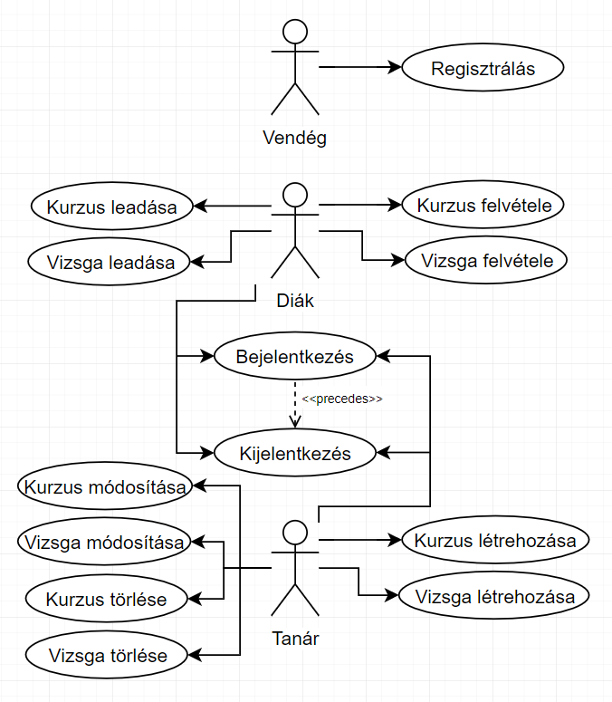
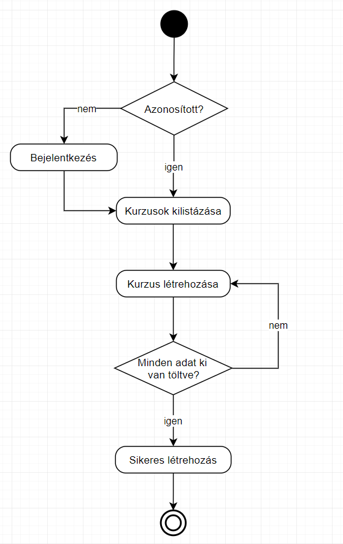

<H1>Alkalmazások fejlesztése beadandó</H1>
<H3>Bevezető</H3>

Az alapötlet a neptun mintájára épülő, az egyetem szereplői számára adminisztrációs feladatok(tantárgyak felvétele/menedzselése tanároknak/diákoknak) kezelésére alkalmas program létrehozása.

<H2>Követelményanalízis</H2>
<H3>Funkcionális követelmények</H3>
<ul>
  <li>Regisztráció</li>
  <li>Bejelentkezés</li>
  <li>Bejelentkezett felhasználóknak
    <ul>
      <li>Tanárnak</li>
        <ul>
          <li>Saját kurzusok törlése/megjelenítése órarendben</li> 
          <li>Saját vizsgák törlése/megjelenítése órarendben</li> 
          <li>Kurzusok/Vizsgák kilistázása</li>
        </ul>
      <li>Diáknak</li>
        <ul>
          <li>Kurzus felvétele/leadása</li>
          <li>Vizsga felvétele/leadása</li>
          <li>Kurzusok/Vizsgák kilistázása</li>
        </ul>
    </ul>
  </li>
</ul>
<H3>Nem funkcionális követelmények</H3>
<ul>
  <li>Felhasználóbarát: Megfelelően elhatárolt funkciók. Világos látható színekkel írt betűk. Ésszerű elrendezés.</li>
  <li>Biztonság: Jelszóval védett funkciók. A jelszavak titkosítottak. A különböző űrlapoknál egy hibalistában kijelzi a program a hibákat.</li>
  <li>Gyors működés: Adatbázisban operáló program, gyors kereséssekkel hamar előállítja a kívánt eredményeket.</li>
</ul>
<H3>Szakterületi fogalomjegyzék</H3>
<ul>
  <li>Kurzus: Az a keret, amelyben a hallgatók meghatározott rend (előadás, gyakorlat, házi feladat, stb.) szerint gyarapítják tudásukat, és arról számot is adnak.</li>
  <li>Vizsga: Tudás számonkérése arról, hogy egy tanuló a kurzus során megtanult anyagot mennyire értette meg, és hogyan tudja alkalmazni. </li>
</ul>

<H3>Használati eset diagram</H3>

<H3>Kurzuslétrehozás menete</H3>

<H2>Tervezés</H2>

<H3>Szerepkörök</H3>
<ul>
  <li>Vendég: nem regisztrált látogató, aki csak a kezdőoldalt tudja megtekinteni, ahol csak regisztrációra/belépésre képes.</li>
  <li>Diák: lásd funkcionális követelmények</li>
  <li>Tanár: lásd funkcionális követelmények</li>
</ul>

<H3>Entitások</H3>
<ul>
  <li>User
    <ul>
      <li>Id (Integer)</li>
      <li>NeptunCode (String)</li>
      <li>Name (String)</li>
      <li>Password (String)</li>
      <li>Courses (List&lt;Course&gt;)</li>
      <li>Exams (List&lt;Exam&gt;)</li>
      <li>Role (Enum)</li>
    </ul>
  </li>
  <li>Course
    <ul>
        <li>Id (Long)</li>
        <li>Name (String)</li>
        <li>MaxLimit (Integer)</li>
        <li>Room (Room)</li>
        <li>RoomNumber (Integer)</li>
        <li>Date (String)</li>
        <li>Students (List&lt;Student&gt;)</li>
    </ul>
  </li>
  <li>Exam
    <ul>
        <li>Id (Long)</li>
        <li>Name (String)</li>
        <li>MaxLimit (Integer)</li>
        <li>Room (Room)</li>
        <li>RoomNumber (Integer)</li>
        <li>Date (String)</li>
        <li>Students (List&lt;Student&gt;)</li>
    </ul>
  </li>
  <li>Room
    <ul>
      <li>Id (Long)</li>
      <li>Name (String)</li>
      <li>MaxLimit (Integer)</li>
      <li>Occupied (Boolean)</li>
      <li>Courses (List&lt;Course&gt;)</li>
      <li>Exams (List&lt;Exam&gt;)</li>
    </ul>
  </li>
</ul>

<H3>UML Diagram</H3>

<H3>Végpontok</H3>
<ul>
  <li>GET/
    <ul>
      <li>/courses: Kurzusok megjelenítése
         <ul>
           <li>/:id : Adott id-hez tartozó kurzus megjelenítése</li>
           <li>/:id/students: Adott id-hez tartozó kurzus diákjainak megjelenítése</li>
           <li>/:id/teacher: Adott id-hez tartozó kurzus tanárának megjelenítése</li>
         </ul>
      </li>
      <li>/exams: Vizsgák megjelenítése
         <ul>
           <li>/:id : Adott id-hez tartozó vizsga megjelenítése</li>
           <li>/:id/students: Adott id-hez tartozó vizsga diákjainak megjelenítése</li>
           <li>/:id/teacher: Adott id-hez tartozó vizsga tanárának megjelenítése</li>
         </ul>
      </li>
      <li>/users: Felhasználók megjelenítése
         <ul>
           <li>/:id : Adott id-hez tartozó felhasználó megjelenítése</li>
           <li>/:id/courses: Adott id-hez tartozó felhasználó kurzusainak megjelenítése</li>
           <li>/:id/exams: Adott id-hez tartozó felhasználó vizsgáinak megjelenítése</li>
         </ul>
      </li>
      <li>/rooms: Termek megjelenítése
         <ul>
           <li>/:id : Adott id-hez tartozó terem megjelenítése</li>
           <li>/:id/courses: Adott id-vel rendelkező teremhez tartozó kurzusok megjelenítése</li>
           <li>/:id/exams: Adott id-vel rendelkező teremhez tartozó vizsgák megjelenítése</li>
         </ul>
      </li>
    </ul>
  </li>
  <li>POST/
    <ul>
      <li>/courses: Kurzus hozzáadása</li>
      <li>/exams: Vizsga hozzáadása</li>
      <li>/users: Felhasználó hozzáadása</li>
      <li>/rooms: Terem hozzáadása</li>
    </ul>
  </li>
  <li>PUT/
    <ul>
      <li>/courses/:id : Adott id-hez tartozó kurzus módosítása</li>
      <li>/exams/:id : Adott id-hez tartozó vizsga módosítása</li>
      <li>/users/:id : Adott id-hez tartozó felhasználó módosítása</li>
      <li>/rooms/:id : Adott id-hez tartozó terem módosítása</li>
    </ul>
  </li>
  <li>DELETE/
    <ul>
      <li>/courses/:id : Adott id-hez tartozó kurzus törlése</li>
      <li>/exams/:id : Adott id-hez tartozó vizsga törlése</li>
      <li>/users/:id : Adott id-hez tartozó felhasználó törlése</li>
      <li>/rooms/:id : Adott id-hez tartozó terem törlése</li>
    </ul>
  </li>
</ul>

<H3>Szekvencia diagram</H3>

<H2>Implementáció</H2>

<H3>Felhasznált eszközök</H3>
<ul>
  <li>Github - verziókezelő</li>
  <li>NetBeans - Java fordító program</li>
  <li>Maven - project management/függőségek kezelése</li>
  <li>Spring/Springboot - keretrendszer</li>
  <li>Visual Studio Code - Lokális IDE </li>
  <li>Node.js - Javascript környezet</li>
</ul>

<H3>Könyvtárstruktúra</H3>
<H4>Backend</H4>
<ul>
  <li>controllers
    <ul>
      <li>CourseController.java</li>
      <li>ExamController.java</li>
      <li>UserController.java</li>
      <li>RoomController.java</li>
    </ul>
  </li>
  <li>entities
    <ul>
      <li>Course.java</li>
      <li>Exam.java</li>
      <li>User.java</li>
      <li>Room.java</li>
    </ul>
  </li>
  <li>repositories
    <ul>
      <li>CourseRepository.java</li>
      <li>ExamRepository.java</li>
      <li>UserRepository.java</li>
      <li>RoomRepository.java</li>
    </ul>
  </li>
  <li>security
    <ul>
        <li>AuthenticatedUser.java</li>
        <li>CustomBasicAuthenticationEntryPoint.java</li>
        <li>MyUserDetailsService.java</li>
        <li>WebSecurityConfig.java</li>
    </ul>
  </li>
  <li>NeptunApplication.java</li>
</ul>

<H4>Frontend</H4>
<ul>
  <li>app
    <ul>
      <li>app-routing.module.ts</li>
      <li>app.component.css</li>
      <li>app.component.html</li>
      <li>app.component.ts</li>
      <li>app.component.spec.ts</li>
      <li>app.module.ts</li>
    </ul>
  </li>
  <li>auth
    <ul>
      <li>auth.guard.spec.ts</li>
      <li>auth.guard.ts</li>
      <li>auth.service.spec.ts</li>
      <li>auth.service.ts</li>
    </ul>
  </li>
  <li>register
    <ul>
      <li>register-form.ts</li>
      <li>register-form.html</li>
      <li>register-form.css</li>
      <li>register-form.spec.ts</li>
    </ul>
  </li>
  <li>login
    <ul>
      <li>login-form.ts</li>
      <li>login-form.html</li>
      <li>login-form.css</li>
      <li>login-form.spec.ts</li>
    </ul>
  </li>
  <li>user
    <ul>
      <li>user.spec.ts</li>
      <li>user.ts</li>
    </ul>
  </li>
  <li>course
    <ul>
      <li>course.service.spec.ts</li>
      <li>course.service.ts</li>
      <li>course.spec.ts</li>
      <li>course.ts</li>
      <li>add-course.ts</li>
      <li>add-course.html</li>
      <li>add-course.css</li>
      <li>add-course.spec.ts</li>
      <li>course-form.ts</li>
      <li>course-form.html</li>
      <li>course-form.css</li>
      <li>course-form.spec.ts</li>
      <li>my-courses.ts</li>
      <li>my-courses.html</li>
      <li>my-courses.css</li>
      <li>my-courses.spec.ts</li>
    </ul>
  </li>
  <li>exam
    <ul>
      <li>exam.service.spec.ts</li>
      <li>exam.service.ts</li>
      <li>exam.spec.ts</li>
      <li>exam.ts</li>
      <li>add-exam.ts</li>
      <li>add-exam.html</li>
      <li>add-exam.css</li>
      <li>add-exam.spec.ts</li>
      <li>exam-form.ts</li>
      <li>exam-form.html</li>
      <li>exam-form.css</li>
      <li>exam-form.spec.ts</li>
      <li>my-exams.ts</li>
      <li>my-exams.html</li>
      <li>my-exams.css</li>
      <li>my-exams.spec.ts</li>
    </ul>
  </li>
  <li>room
    <ul>
      <li>room.service.spec.ts</li>
      <li>room.service.ts</li>
      <li>room.spec.ts</li>
      <li>room.ts</li>
      <li>add-room.ts</li>
      <li>add-room.html</li>
      <li>add-room.css</li>
      <li>add-room.spec.ts</li>
      <li>exam-room.ts</li>
      <li>exam-room.html</li>
      <li>exam-room.css</li>
      <li>exam-room.spec.ts</li>
      <li>my-rooms.ts</li>
      <li>my-rooms.html</li>
      <li>my-rooms.css</li>
      <li>my-rooms.spec.ts</li>
    </ul>
  </li>
  <li>status-filter
    <ul>
      <li>status-filter.ts</li>
      <li>status-filter.html</li>
      <li>status-filter.css</li>
      <li>status-filter.spec.ts</li>
    </ul>
  </li>
  <li>routing
    <ul>
      <li>routing.ts</li>
      <li>routing.html</li>
      <li>routing.css</li>
      <li>routing.spec.ts</li>
    </ul>
  </li>
</ul>

<H2>Felhasználói dokumentáció</H2>
<H3>Telepítés</H3>
<H4>A telepítéshez szükséges:</H4>
<ul>
    <li>NodeJS és npm, ami innen letölthető: <a href="https://www.npmjs.com/get-npm/">npmjs.com/get-npm</a></li>
    <li>Internet elérés</li>
</ul>
<H4>Teleptés:</H4>
<ol>
  <li>Látogasson el a <a href="https://github.com/heymisi/alkfejl/">github.com/heymisi/alkfejl</a> oldalra.</li>
  <li>Itt kattintson a <b>"Clone and Download"</b> gombra, és azon belül kattintson a <b>"Download as Zip"</b> gombra.</li>
  <li>A letöltött állományt csomagolja ki.</li>
  <li><b>npm i</b> parancsot adjuk ki parancssorban a kicsomagolt állomány mappájában.</li>
  <li><b>npm start</b>-al elindíthatjuk a programot.</li>
</ol>
<H3>Használata</H3>
<ol>
  <li>Böngészőben a keresősávba írjuk be, hogy: <b>localhost:8080</b></li>
  <li>Regisztrálás és bejelentkezés után használhatjuk a programot.</li>
</ol>
